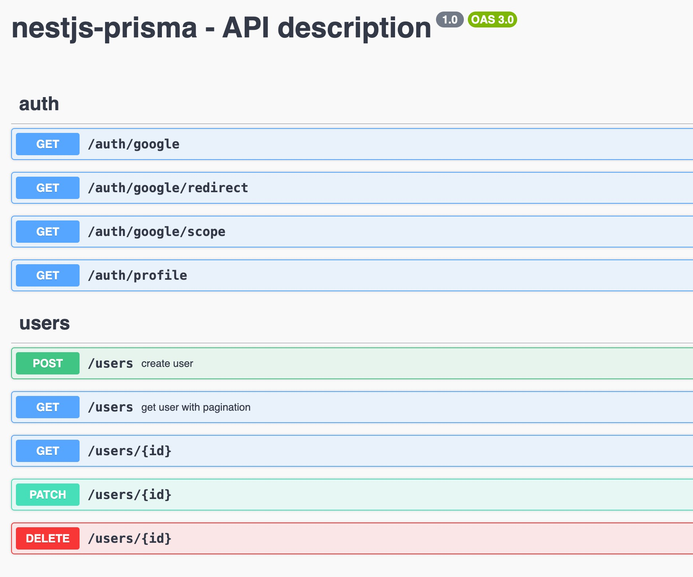
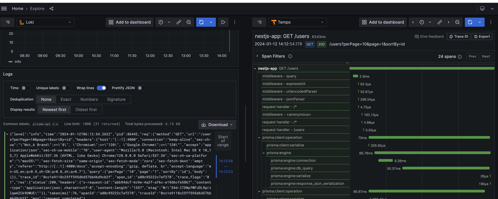
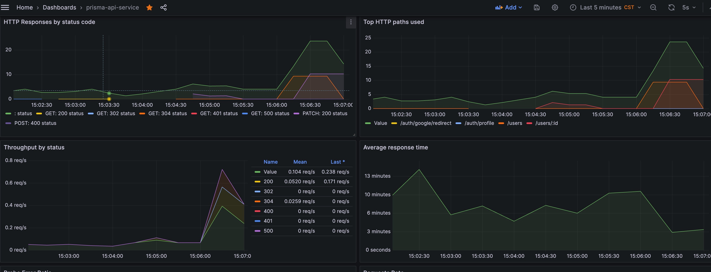
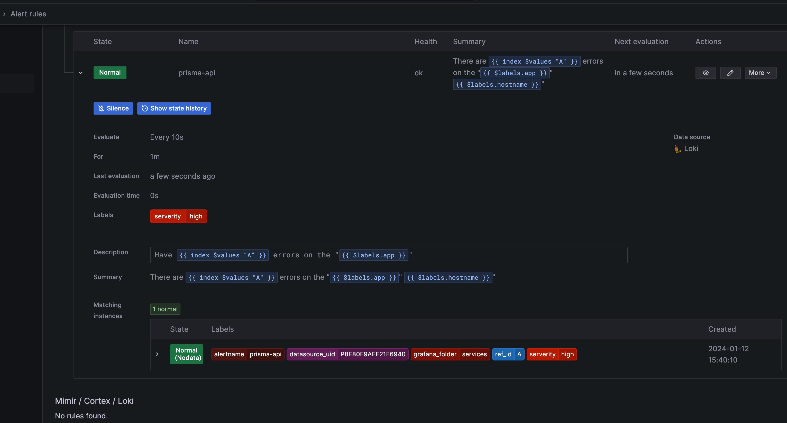
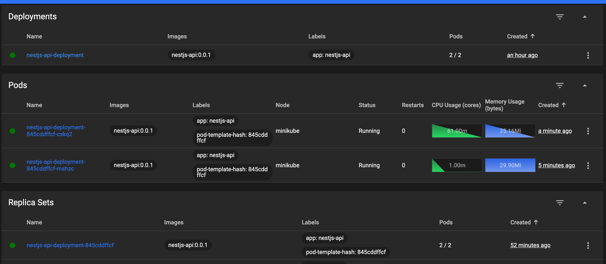
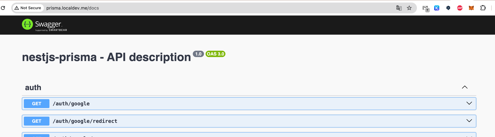

# Nestjs Prisma Template

This is an opinionated template for Nestjs prisma restful projects.

## Features

- [x] Platform: [Express](https://expressjs.com/)
- [x] Database:
  - [x] ORM: [Prisma](https://prisma.io)
  - [ ] Redis: [Redis](https://github.com/songkeys/nestjs-redis)
- Cache Manager: [cache-manager](https://github.com/nestjs/cache-manager)
- [x] Logger: [Pino](https://github.com/pinojs/pino)

  - [nestjs-pino](https://github.com/iamolegga/nestjs-pino)
  - [rotating-file-stream](https://github.com/iccicci/rotating-file-stream)
  - [pino-pretty](https://github.com/pinojs/pino-pretty) in development
  - [pino-loki](https://github.com/Julien-R44/pino-loki)

- [x] health
- [x] Authentication: [Passport](https://github.com/nestjs/passport)
  - JWT: [passport-jwt](https://www.passportjs.org/packages/passport-jwt/)
  - Google: [passport-google-oauth20](https://www.passportjs.org/packages/passport-google-oauth20/)
- [x] Swagger: [@nestjs/swagger](https://github.com/nestjs/swagger)
- [x] Tracing: [nestjs-otel](https://github.com/pragmaticivan/nestjs-otel)
  - [x] [grafana](https://grafana.com/docs/grafana/latest/)
  - [x] [loki](https://grafana.com/docs/loki/latest/)
  - [x] [prometheus](https://prometheus.io/)
  - [x] [promtail](https://grafana.com/docs/loki/latest/send-data/promtail/)
  - [x] [tempo](https://grafana.com/docs/tempo/latest)
  - [x] [alertmanager](https://grafana.com/docs/grafana/latest/alerting/set-up/migrating-alerts/legacy-alerting/grafana-cloud-alerting/alertmanager/)
- [x] k8s

## Guide

### Development

Init environment variables:

```bash
cp .env.example .env
```

Install dependencies:

```bash
pnpm install
```

Generate Prisma client:

```bash
pnpm run prisma:migrate
```

Migrate database:

```bash
pnpm run prisma:migrate:dev
```

Run the app:

```bash
pnpm run start:dev
```

### Deployment with docker

Docker:

```bash
docker-compose build
```

### start docker-compose

```bash
docker-compose up -d
```

In Node.js Environment:

```bash
pnpm install
pnpm run build
pnpm run start:prod
```

### Migrate database

Development:

```bash
pnpm run prisma:migrate:dev
```

Production:

```bash
pnpm run prisma:migrate:deploy
```

## Overview

swagger



`opentelemetry`



`prometheus`



`alerting`


`k8s`


`ingress`


## Thanks the following projects

- [nestjs-prisma](https://github.com/notiz-dev/nestjs-prisma)
- [nestjs-otel](https://github.com/pragmaticivan/nestjs-otel)
- [nestjs-otel-prom-grafana-tempo](https://github.com/pragmaticivan/nestjs-otel-prom-grafana-tempo)
